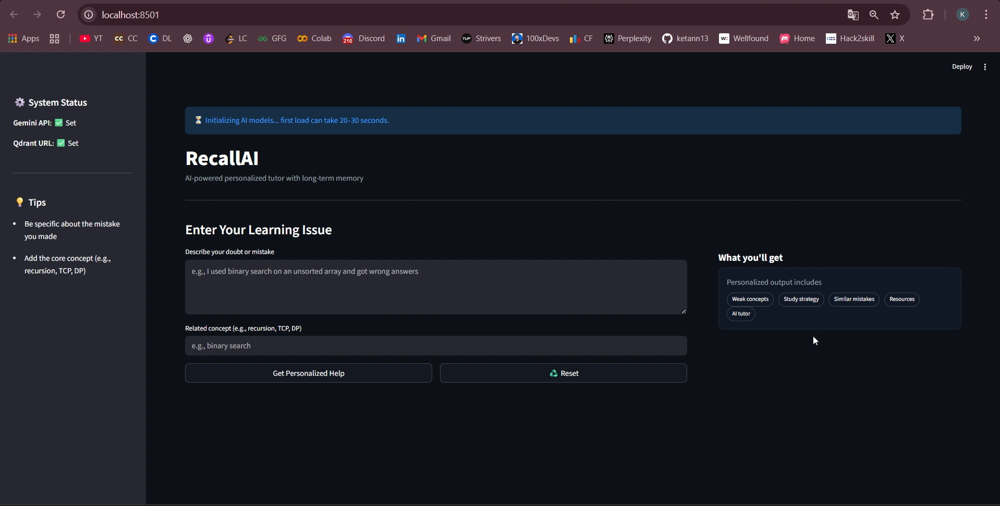
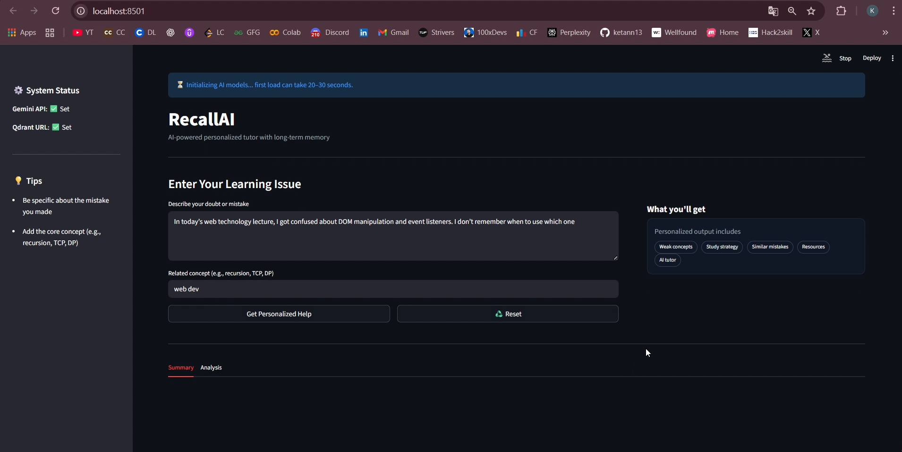
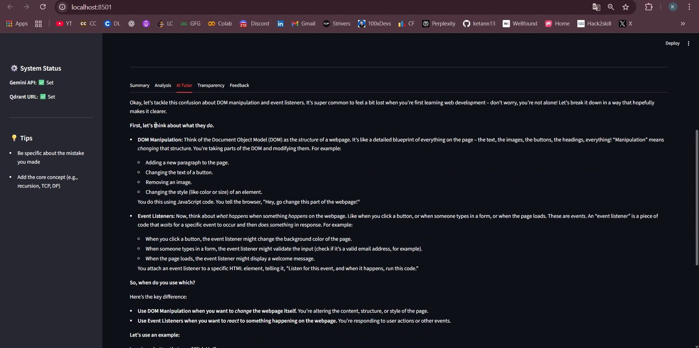

# RecallAI — Multi-Agent Personalized Learning Assistant

RecallAI is an AI-powered personalized learning system that helps students retain concepts by learning from their past mistakes and adapting future explanations and learning strategies accordingly. It combines Multi-Agent Systems, Vector Memory (Qdrant), and LLM reasoning (Gemini) to deliver adaptive education across multiple subjects.

## 🚀 Key Features
- ✅ Long-term semantic memory using Qdrant Vector Database
- ✅ Multi-Agent architecture with clear agent responsibilities
- ✅ Detects repeated weak concepts automatically
- ✅ Dynamic learning strategy selection:
  - Onboarding (new topic)
  - Practice (occasional mistakes)
  - Remediation (repeated struggle)
- ✅ Personalized explanations using Gemini LLM
- ✅ Transparent AI decision-making
- ✅ Works across subjects: CS, Mathematics, Theory, etc.

## 🎯 Problem Statement
Students frequently forget concepts — not only in programming, but also in subjects like mathematics, operating systems, networking, and theory-based courses.

Most learning platforms:
- Treat all students the same
- Do not track individual learning behavior
- Do not adapt based on repeated mistakes

As a result, students repeatedly struggle with the same concepts without receiving targeted remediation.

**RecallAI solves this by:**
- Tracking individual learning mistakes
- Detecting recurring weak concepts
- Selecting appropriate learning strategies
- Providing personalized AI explanations

## 🏗️ System Architecture (Multi-Agent)
RecallAI follows a modular multi-agent design:

| Agent | Responsibility |
|---|---|
| Planner Agent | Orchestrates entire workflow |
| Memory Agent | Stores and retrieves learning events from Qdrant |
| Pattern Agent | Detects repeated weak concepts |
| Retrieval Agent | Fetches relevant learning resources |
| Recommendation Agent | Generates learning advice |
| LLM Tutor Agent | Generates explanations using Gemini API |
| Streamlit UI | User interaction interface |

## 🔄 Workflow
1. Student enters doubt and concept
2. Memory Agent stores learning event in Qdrant
3. Similar past mistakes are retrieved using semantic search
4. Pattern Agent detects weak concepts
5. Planner Agent selects learning strategy
6. Recommendation Agent suggests actions
7. LLM Tutor Agent generates personalized explanation
8. UI displays results with transparency

## 🧠 Memory System (Qdrant)
Each learning event is:
- Converted into embeddings using Sentence Transformers
- Stored in Qdrant as a vector with metadata
- Queried using similarity search

This enables RecallAI to remember conceptual mistakes, not just keywords.

## 📸 Screenshots




## 🛠️ Tech Stack
- Frontend: Streamlit
- Backend: Python
- Vector Database: Qdrant (Local or Cloud)
- Embeddings: SentenceTransformers (MiniLM)
- LLM: Google Gemini API
- Architecture: Multi-Agent System

## ⚙️ Local Setup Instructions
1. Clone Repository
  ```bash
  git clone https://github.com/your-username/RecallAI.git
  cd RecallAI
  ```
2. Create Virtual Environment
  ```bash
  python -m venv .venv
  source .venv/bin/activate   # Mac/Linux
  .venv\Scripts\activate      # Windows
  ```
3. Install Dependencies
  ```bash
  pip install -r requirements.txt
  ```
4. Setup Environment Variables

  Create a .env file (do NOT commit to GitHub):
  ```env
  GEMINI_API_KEY=your_api_key
  QDRANT_URL=your_qdrant_url
  QDRANT_API_KEY=your_qdrant_key
  ```
5. Setup Qdrant Collections
  ```bash
  python src/mas_learning_agent/qdrant_db/setup_collections.py
  ```
6. Run Application
  ```bash
  streamlit run app/streamlit_app.py
  ```

Open browser at:
👉 http://localhost:8501

## 📊 Subjects Supported
RecallAI is designed to be subject-agnostic:
- 💻 Computer Science (DSA, Networks, OS, DBMS)
- ➗ Mathematics
- 📘 Theory Subjects
- 📚 Any concept-based learning domain

Only resources need to be updated for new subjects.

## 📈 Future Enhancements
- 📊 Student progress dashboards
- 🎯 Adaptive difficulty question generation
- 🧩 Quiz-based reinforcement
- 🎙 Voice-based tutoring
- 📱 Mobile interface
- 🎓 LMS integration

## 🧪 Evaluation Strategy
RecallAI supports:
- User feedback loops
- Resource improvement over time
- Strategy effectiveness tracking

This allows continuous learning system improvement.

## 👨‍💻 Author
Ketan Dnyaneshwar Patil
